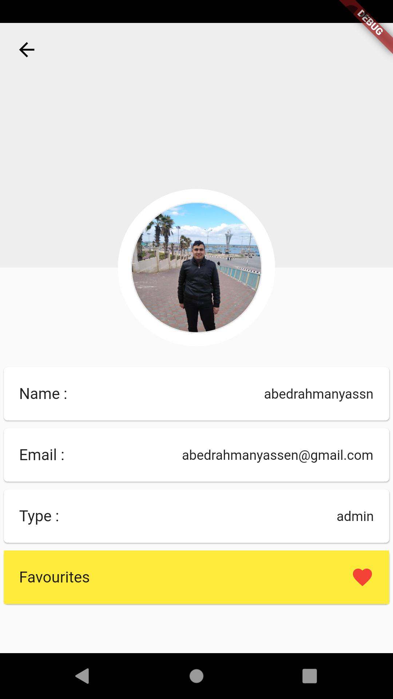

# ecommerce_app_training

This is a simple incomplete E-commerce app using firebase.
## Getting Started
the app is missing a few things not implemented yet including : 
1. implementing some buttons like sort be, favourites and Add to cart.
2. search boxes is not implemented yet.
3. some other small things are missing.
4. sending the orders to the firebase.

| | ||
| ------------|------------|------------|
||||

